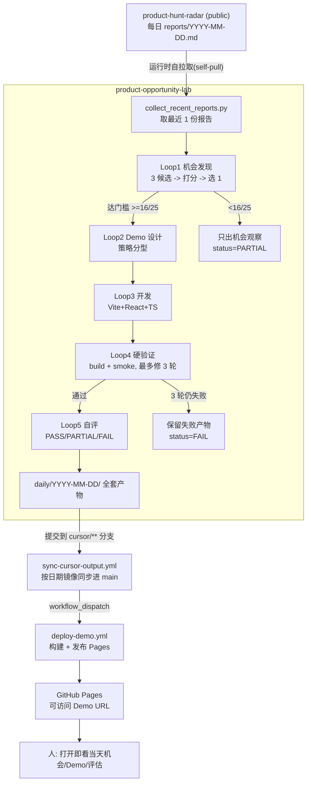

# Product Opportunity Lab · 设计与 Loop Engineering 学习笔记

> 目的：把这个项目当成一个"活的" Loop Engineering 案例来拆解，既讲**它怎么设计的**，
> 也讲**背后可迁移的工程思路**，并客观记录三次真实运行和两次故障暴露出的经验教训。
> 面向读者：想学"如何设计一个能无人值守、自我校验、持续产出的 AI 循环系统"的人。

---

## 0. 一句话概括

> Loop Engineering ≠ "让模型跑一次生成东西"，而是 **设计一个受约束、可自校验、能诚实降级的循环**，
> 把一条稳定的输入流，反复加工成"经过硬验证"的产物，并把结果零摩擦地送到人面前。

这个项目就是一个具体实现：每天把 Product Hunt 日报 → 变成一个"有创新点、能跑、可体验"的产品机会 Demo。

---

## 1. 项目全景：它到底在做什么

```text
每日产品扫描(radar) → 客观机会分析 → 创新切入点选择 → Demo 原型生成 → 自动验证 → 部署可体验 URL
```

- 上游 `product-hunt-radar`：**信号采集层**，每天产出 `reports/YYYY-MM-DD.md`（稳定输入源）。
- 本项目 `product-opportunity-lab`：**机会加工层 / 原型实验场**，每天读最近 1 份报告，产出一整套机会分析 + 可运行 Demo + 自测报告，并自动上线。

关键：两者是**两个独立仓库**。这不是洁癖，而是第一条设计原则（见 §4.1）。

---

## 2. 架构与数据流



**只有一个定时器**：云端 Cursor Automation（每天 08:00）。两个 GitHub workflow 都是**事件触发**，全链路无 GitHub Actions cron。

---

## 3. 组件逐个拆解（每个文件的角色 + 为什么）

| 文件 | 角色 | 设计意图（为什么） |
| --- | --- | --- |
| [config/lab-focus.md](../config/lab-focus.md) | 关注方向 + 五维评分 + 门槛 + 两条硬原则 | 把"评判标准"从流程里抽出来做成**配置**，可调、可审计 |
| [loops/daily-demo-loop.md](../loops/daily-demo-loop.md) | 循环主规范：Persona + 5 阶段 + 约束 + 降级 | 让 Automation "读文件执行"，而非塞一大段一次性 prompt；流程**版本可控** |
| [scripts/collect_recent_reports.py](../scripts/collect_recent_reports.py) | 运行时自拉取 public radar 报告 | 去掉跨仓库定时同步的脆弱耦合（见 §4.11） |
| [scripts/validate_demo.sh](../scripts/validate_demo.sh) | `npm install/build` + smoke 硬检查 | **确定性验证闸门**，不信模型口头声称（见 §4.7） |
| [scripts/validate_daily_output.py](../scripts/validate_daily_output.py) | 校验产物齐全 + status 合法 | 让"完成"有客观标准，随 status 放宽/收紧 |
| [scripts/build_pages_index.py](../scripts/build_pages_index.py) | 生成 Pages 根索引 | 历史产物可浏览，闭合"送到人面前"这一步 |
| templates/* | 产物模板（把硬要求固化进结构） | 把"必须写不照抄声明/客观性区分"变成模板里的**必填项** |
| .github/workflows/sync-cursor-output.yml | cursor 分支 → main 镜像同步 + 触发部署 | 免人工 PR/merge 的集成 |
| .github/workflows/deploy-demo.yml | 构建最新 Demo → 发布 Pages | 免人工的"最后一公里" |
| daily/YYYY-MM-DD/status.json | 机器可读状态 | 让循环状态可被程序消费（见 §4.9） |
| daily/YYYY-MM-DD/source-report.md | 本次输入的存档 | provenance：产物可追溯到确切输入 |

---

## 4. Loop Engineering 的核心思路点

> 这一节是笔记的重点。每条都给出"是什么 / 为什么 / 在本项目怎么体现"。

### 4.1 分层解耦：稳定输入源 vs 易变加工层
- **为什么**：实验代码、依赖、构建失败会"污染"稳定资产。把两者放一起，日报仓库迟早被 Demo 的 node_modules、构建垃圾、失败记录搞脏。
- **体现**：radar（稳定信号库）与 lab（实验场）是两个独立仓库，各自演进。

### 4.2 用 Persona 作为"控制输入"，而非装饰
- **为什么**：模型输出的"分布"会被角色设定强烈影响。给它"连续 AI 创业者"的身份，是在**引导判断质量**（洞察真需求、警惕伪需求、务实到能一天做出 Demo）。
- **体现**：Persona 写在 `config/lab-focus.md`、`loops/daily-demo-loop.md`、`AUTOMATION.md` 三处开头，贯穿全流程。

### 4.3 把"参考资料"和"结论"分开（反盲从 / 反谄媚）
- **为什么**：如果把输入报告直接当结论，循环就退化成"复述"。让 Agent 显式区分"报告事实 vs 我的独立判断"，是一种**反幻觉、反谄媚**的结构约束。
- **体现**：`opportunity.md` 模板里有一张"报告怎么说 / 我作为创业者的独立判断"对照表，且允许质疑报告。

### 4.4 反抄袭 = 强制"增量价值"的 forcing function
- **为什么**：能创新才有价值；照抄的话用户直接去用原产品即可。硬性要求"创新切入点 / 解决的具体问题 / 相对被参考产品的增量 / 为何非照抄"，会**逼**循环产出新东西。
- **实证**：同一天报告、连跑三次，得到三个**完全不同**的产品方向（见 §7）。这就是约束在起作用。

### 4.5 先发散后收敛（Divergence before convergence）
- **为什么**：直接选 1 个容易锚定/隧道视野。先出 ≥3 个候选并打分，是**结构化探索**再利用。
- **体现**：Loop1 强制"生成至少 3 个候选创新方向 → 五维打分 → 选最高分"。

### 4.6 量化门槛 + 诚实降级（允许说"不值得"）
- **为什么**：无门槛的循环会为了产出而产出（凑数、包装）。给一个可量化闸门，并允许"不达标就不硬做"。
- **体现**：五维 0–5 共 25 分，`<16/25` → 只出机会观察，`status=PARTIAL`；结论只能是 `PASS/PARTIAL/FAIL`，不许模糊表述。

### 4.7 硬验证，不信"口头声称"（最重要的一条）
- **为什么**：Loop Engineering 最大的陷阱是"模型说它做好了"。必须用**机器可检验的闸门**代替自我声称。**证据先于断言。**
- **体现**：`validate_demo.sh` 真跑 `npm install && npm run build` + 检查 `dist/index.html` 非空/含挂载节点/有 JS bundle；首轮还用无头浏览器实机渲染截图确认"首屏不是空白"。

### 4.8 有界自我修复 + 明确的终止失败态
- **为什么**：无界重试要么死循环，要么假装成功。修复必须**有上限**，且有一个诚实的"我失败了"终态。
- **体现**：build 失败最多修 3 轮；3 轮仍失败 → 保留失败产物 + 写清原因 + `status=FAIL`，**不得标 PASS**。

### 4.9 机器可读状态 + 可复现产物
- **为什么**：循环要能被程序消费、被审计、被复现。
- **体现**：`status.json`（机器可读）、`run-log.md`（过程）、`source-report.md`（输入存档 provenance）。

### 4.10 自适应：按输入类型切换方法（策略分型）
- **为什么**：一刀切的方法处理不了"抽象/CLI/基础设施类"产品——它们没有天然界面。
- **体现**：Demo 策略分型——可视化类→直接交互 Demo；抽象类→"模拟体验 + 价值可视化"。正是靠这条，Contextlens（上下文窗口 X 光）和 Fusebox（能力配电箱）这种基础设施概念才能被"演示"出来。

### 4.11 为"无人值守可靠性"而设计
- **为什么**：能自动跑起来，和能**可靠地**自动跑，是两回事。
- **体现**：
  - 用"运行时自拉取"取代"两个定时 workflow 卡点同步"，去掉脆弱的时序耦合与 cron 时区坑；
  - 事件触发优先于定时触发；
  - 无报告也能优雅退出（写 `insufficient-input.md`，正常结束不报错）。

### 4.12 闭合"最后一公里"
- **为什么**：循环的价值只有在结果**零摩擦**到达人面前时才兑现。生成完不等于用户看得到。
- **体现**：sync → deploy → Pages URL，人早上打开即看当天机会/Demo/评估，无需任何手动操作。

---

## 5. 一个关键架构观：把"决策"与"验证"分开

这是本项目最值得学的结构：

| 层 | 谁负责 | 特点 |
| --- | --- | --- |
| **决策层**（选什么机会、怎么设计、写什么代码） | LLM / Agent | 擅长开放式判断与创造，但**不可信其自证** |
| **验证层**（能不能 build、产物齐不齐、状态合不合法） | 确定性脚本 / CI | 便宜、可重复、不会说谎 |

> 口诀：**让模型做判断，让脚本做裁判。** 模型负责"生成可能性"，确定性闸门负责"筛掉不合格"。
> 循环的可靠性，来自这两层的配合，而不是让模型同时当运动员和裁判。

---

## 6. 风险 → 控制机制 映射

| 风险 | 控制机制 |
| --- | --- |
| 模型自嗨（伪需求、概念包装） | 必须引用报告具体信号 + 写清机会来源 + 写不确定性 + 允许结论"不建议继续" |
| 照抄现有产品 | 不照抄四项声明；本质克隆则判不合格重选 |
| Demo 不可运行 | 必须 build + smoke；失败重试；失败不得标 PASS |
| Scope 失控（想做后端系统） | 只允许纯前端静态 Demo、≤3 页、全 mock |
| 仓库污染 | 不提交 node_modules/dist；产物按日隔离；失败也有 run-log |
| 把自评当真实验证 | 明确非目标：模型自评 ≠ 真实用户验证 |

---

## 7. 从三次真实运行学到的（客观复盘）

同一天（2026-07-03）、同一份报告，人工首轮 + 两次自动运行，得到三个**完全不同**的产品：

| 运行 | 产物 | 切入点 | Demo 策略 |
| --- | --- | --- | --- |
| 人工首轮 | **Gavel** 审批驾驶舱 | 高危动作的"决策上下文装配 + 裁决即策略" | 交互类 |
| 自动第 2 次 | **Contextlens** 上下文窗口 X 光 | 把"上下文窗口本身"变成可观测/可对比对象 | 模拟可视化 |
| 自动第 3 次 | **Fusebox** 能力配电箱 | 把工具/MCP 权限画成能力图，发现"组合起来才高危"的链路 | 模拟可视化 |

**观察**：三次都源自同一份报告的"Agent 执行证据与审批控制面"信号，但切入点各异——**这直接证明了 §4.4 的反抄袭约束是有效的**（否则三次会趋同/复读报告里的 Retrace/scritty/Basedash）。

### 客观局限（同样重要）
- `PASS` 只代表"能 build + 产物齐全 + 首屏非空"，**不代表市场验证**。这是刻意的非目标。
- 24/25 这类分数是 **Agent 自评**，可能偏高；门槛闸门能缓解但不能消除自利打分。
- Demo 全 mock，**从 Demo 到真实产品是一次大的工程跃迁**（每个 Demo 自己也标注了这一点）。
- 同一天覆盖是测试造成的巧合；正常按天推进不会撞日期，但"同单元重跑要能干净覆盖"这个需求是真实的（见 §8 缺陷一）。

---

## 8. 两次故障的教训（本笔记最有价值的部分）

> 你无法在纸面上设计出完美的循环。你**运行它、观察失败、再加固**——这正是 Loop Engineering 的本质：对一个自治过程的迭代硬化。

### 缺陷一：状态残留（Idempotency / 幂等性）
- **现象**：第 2 次运行换了新方向（Contextlens）覆盖旧的 Gavel，但同步用 `cp -R` **只加不删**，旧组件文件残留在 main，引用了已删除的类型 → `tsc`/构建失败。
- **根因**：`cp -R` 是"叠加"语义，不是"镜像"语义。
- **修复**：同步改为**按日期目录镜像**（`rm -rf <date>` 后再复制），旧文件不再残留。
- **可迁移原则**：**会重写产物的循环，必须用"全量替换/镜像"语义，而不是"覆盖叠加"。** 否则旧状态会腐蚀新状态。

### 缺陷二：自动化的触发与权限边界
- **现象**：`sync` 用 `GITHUB_TOKEN` 推 main 后，`deploy-demo.yml` 没被触发，Pages 停在旧版本。
- **根因**：GitHub 故意规定"用 `GITHUB_TOKEN` 产生的事件**不会**触发别的 workflow"（防递归）。
- **修复**：改用 `gh workflow run`（`workflow_dispatch` 是该规则的**例外**）显式触发；并补上 `actions: write` 权限（dispatch 需要）。
- **可迁移原则**：**CI 串起来的循环，必须理解每一跳的"触发语义 + 权限边界"**——它们往往反直觉。

### 缺陷三（附带认知）：自愈的边界该画在哪
- **现象**：云端 Agent **自己诊断出**权限缺失并在它的分支里绕过，但这个修复**进不了 main**——因为 sync 只同步 `daily/*`，不同步 workflow 文件。
- **这是设计使然，而且是好事**：
  - 循环可以自我修改的，只有**产物**（daily/*）；
  - **基础设施 / 治理规则（workflow、门槛、权限）不允许被循环自改**，必须由人/owner 直接落到 main。
- **可迁移原则**：**明确划定"循环能自改什么、不能自改什么"。** 让 Agent 能"发现并上报" infra 问题，但由人来"落地" infra 变更——这是一条重要的安全边界。

### 关于"人在回路"的位置
本项目刻意选择：
- **内容循环**：人完全在环外（每天全自动出机会/Demo）。
- **基础设施变更**：人在环内（main 受保护、每次 push 需确认）。

> 学习点：Loop Engineering 不是"要不要人"，而是**把人放在哪个闸门上**——把人放在"高杠杆、低频、不可逆"的地方（infra/发布），把人从"高频、低风险、可重来"的地方（每日内容）解放出来。

---

## 9. 可迁移的清单：如果你要自己造一个 Loop

1. 找一条**稳定的输入流**，并与加工层**分仓解耦**。
2. 给 Agent 一个明确 **Persona** 作为判断的"引导先验"。
3. 把**评判标准**抽成配置（关注点、评分、门槛）。
4. 强制**先发散（多候选+打分）再收敛（选 1）**。
5. 设**量化门槛**并允许**诚实降级**（PASS/PARTIAL/FAIL，允许"不值得"）。
6. 用**确定性脚本当裁判**，绝不信模型自证（build/smoke/schema 校验）。
7. 自我修复要**有上限**，并有**终止失败态**。
8. 产出**机器可读状态 + provenance**，让循环可审计可复现。
9. 按输入类型**自适应方法**（策略分型）。
10. 为**无人值守可靠性**设计：去脆弱耦合、事件触发、优雅处理空输入。
11. 闭合**最后一公里**：结果零摩擦送达人。
12. 想清楚**循环能自改什么**，把人放在高杠杆闸门上。
13. **先运行、再加固**：把失败当成设计输入，迭代硬化。

---

## 10. 这个项目还能怎么进化（局限与下一步）

- **自评偏乐观** → 可引入第二个"批判者"Agent 或更硬的启发式反查（当前是单一 Agent 自评）。
- **build 通过 ≠ 体验好** → 可在 CI 里加无头浏览器渲染 + 关键元素断言（把"首屏非空"从人工升级为自动闸门）。
- **同一天多次运行会互相覆盖** → 可支持"当天多方向并存"（子目录），而不是覆盖。
- **Demo 质量依赖单次云端运行** → 可加 best-of-N（跑多个候选取最优）。
- **从 Demo 到产品的跃迁** → 目前刻意止步于概念验证；下一步可对"通过 + 高分"的机会做更深一层的可行性/接入方案分析。

---

> 小结：这个项目值得学的，不是"用 AI 生成 Demo"，而是**如何把一个开放式的创造任务，装进一个有约束、能自校验、会诚实失败、且结果能自动送达的循环里**。而它真正跑起来后暴露的两个 CI 缺陷，比任何设计文档都更能说明——**Loop Engineering 是"运行 → 观察失败 → 加固"的持续工程，而非一次性的架构设计。**
